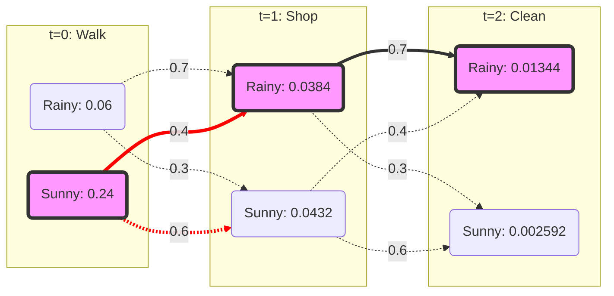

# Viterbi Algorithm Walkthrough: Rain vs. Sun

This document visualizes the Viterbi algorithm step-by-step using the "Rain/Sun" example from our test suite.

## Model Parameters

*   **States**: `Rainy (0)`, `Sunny (1)`
*   **Observations**: `Walk (0)`, `Shop (1)`, `Clean (2)`
*   **Start Probabilities**:
    *   Rainy: 0.6
    *   Sunny: 0.4
*   **Transition Probabilities** ($P(State_t | State_{t-1})$):
    *   Rainy $\to$ Rainy: 0.7, Rainy $\to$ Sunny: 0.3
    *   Sunny $\to$ Rainy: 0.4, Sunny $\to$ Sunny: 0.6
*   **Emission Probabilities** ($P(Obs | State)$):
    *   Rainy: Walk=0.1, Shop=0.4, Clean=0.5
    *   Sunny: Walk=0.6, Shop=0.3, Clean=0.1

## Sequence to Solve
**Observations**: `Walk` $\to$ `Shop` $\to$ `Clean`

---

## Step 1: Initialization ($t=0$)
**Observation**: `Walk`

We calculate the probability of starting in each state and emitting 'Walk'.
$$P(State) \times P(Walk | State)$$

*   **Rainy**: $0.6 \times 0.1 = \mathbf{0.06}$
*   **Sunny**: $0.4 \times 0.6 = \mathbf{0.24}$

| State | Probability | Backpointer |
| :--- | :--- | :--- |
| Rainy | 0.06 | None |
| Sunny | **0.24** | None |

---

## Step 2: Recursion ($t=1$)
**Observation**: `Shop`

We calculate the max probability of reaching each state at $t=1$ from any state at $t=0$.
Formula: $P(PrevState) \times P(State | PrevState) \times P(Shop | State)$

### Target: Rainy
*   From Rainy: $0.06 \times 0.7 = 0.042$
*   From Sunny: $0.24 \times 0.4 = \mathbf{0.096}$ (Winner)
*   **Total**: $0.096 \times 0.4 (\text{Emission}) = \mathbf{0.0384}$
*   **Backpointer**: Sunny

### Target: Sunny
*   From Rainy: $0.06 \times 0.3 = 0.018$
*   From Sunny: $0.24 \times 0.6 = \mathbf{0.144}$ (Winner)
*   **Total**: $0.144 \times 0.3 (\text{Emission}) = \mathbf{0.0432}$
*   **Backpointer**: Sunny

| State | Probability | Backpointer |
| :--- | :--- | :--- |
| Rainy | 0.0384 | Sunny |
| Sunny | **0.0432** | Sunny |

---

## Step 3: Recursion ($t=2$)
**Observation**: `Clean`

### Target: Rainy
*   From Rainy: $0.0384 \times 0.7 = \mathbf{0.02688}$ (Winner)
*   From Sunny: $0.0432 \times 0.4 = 0.01728$
*   **Total**: $0.02688 \times 0.5 (\text{Emission}) = \mathbf{0.01344}$
*   **Backpointer**: Rainy

### Target: Sunny
*   From Rainy: $0.0384 \times 0.3 = 0.01152$
*   From Sunny: $0.0432 \times 0.6 = \mathbf{0.02592}$ (Winner)
*   **Total**: $0.02592 \times 0.1 (\text{Emission}) = 0.002592$
*   **Backpointer**: Sunny

| State | Probability | Backpointer |
| :--- | :--- | :--- |
| Rainy | **0.01344** | Rainy |
| Sunny | 0.002592 | Sunny |

---

## Step 4: Termination & Backtracking

1.  **Find Best End State**: At $t=2$, Rainy (0.01344) > Sunny (0.002592).
    *   **End State**: **Rainy**
2.  **Backtrack**:
    *   **$t=2$**: State is **Rainy**. Who was the best previous state? Look at Rainy's backpointer at $t=2$.
        *   $\to$ **Rainy**
    *   **$t=1$**: State is **Rainy**. Who was the best previous state? Look at Rainy's backpointer at $t=1$.
        *   $\to$ **Sunny**
    *   **$t=0$**: State is **Sunny**. Start.

**Final Path**: Sunny $\to$ Rainy $\to$ Rainy

## Visual Diagram (Mermaid)

*Note: The thick/red lines indicate the chosen path (backpointers).*
